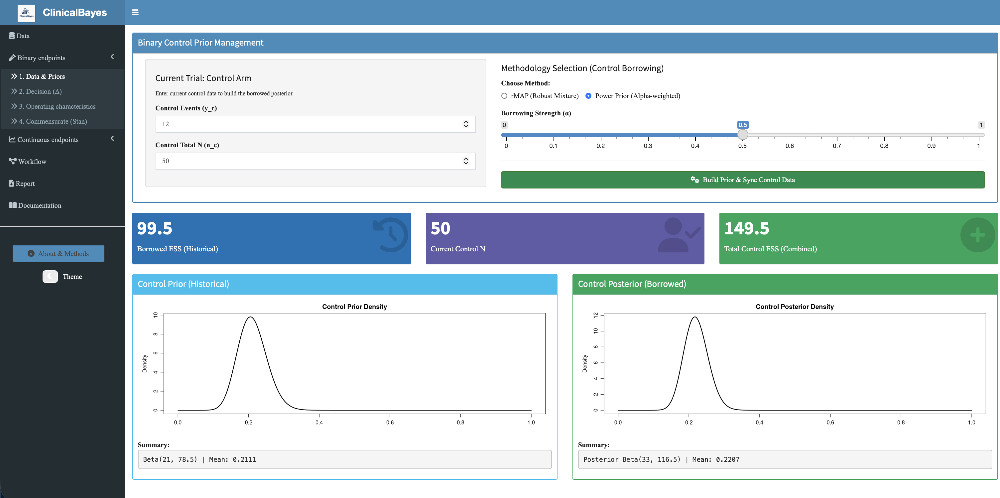
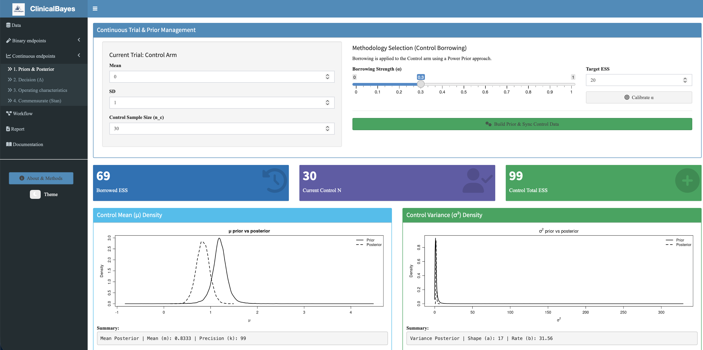

 
<h1 align="center">
ClinicalBayes: Bayesian Borrowing for Clinical Trials
 
 
 

</h1>

---

## 🧭 Overview

**ClinicalBayes** is an advanced interactive **R Shiny application** designed for Statisticians and Clinical Researchers to implement **Bayesian Dynamic Borrowing**. It facilitates the integration of historical control data into current clinical trials to enhance statistical power and optimize decision-making.

This toolkit enables users to:

-   **Implement Dynamic Borrowing:** Utilize sophisticated methods like rMAP and Power Priors to leverage historical information without compromising trial integrity.
-   **Quantify Evidence:** Calculate Effective Sample Size (ESS) to understand the "worth" of borrowed data in terms of patient numbers.
-   **Simulate Outcomes:** Evaluate the Operating Characteristics (Type I Error and Power) of a design under varying treatment effects.

## 🚀 Features & Modules

| Module | Detail | Primary Output | Goal |
|------------------|------------------|------------------|------------------|
| **Binary Endpoints** | Dynamic borrowing for proportions (rMAP, Power Prior). | Posterior Densities / ESS Boxes | Calculating borrowed control evidence. |
| **Continuous Endpoints** | Normal-Inverse-Gamma modeling for mean and variance. | Mu/Sigma Overlay Plots | Handling unknown variance in borrowing. |
| **Decision Analysis** | Posterior probability $P(\Delta > \Delta^* \mid \text{data})$. | Threshold Histograms | Determining trial "Go/No-Go" status. |
| **Op. Characteristics** | Monte Carlo simulation over grids of true effects. | Power/Alpha Curves | Validating design robustness. |
| **Commensurate Prior** | MCMC-based borrowing via Stan. | Trace Plots / Shrinkage Summary | Data-driven conflict handling. |

## 🔬 Core Methodology

### 🧠 Informative Priors
The application centers on the construction of informative priors. For binary endpoints, it supports **rMAP (Robust Meta-Analytic Prior)**, which uses a mixture model to guard against "prior-data conflict" by adding a non-informative component. For continuous data, it employs **Normal-Inverse-Gamma** distributions to simultaneously borrow information on both means and variances.

### ⚖️ Power Prior Calibration
The **Power Prior** approach ($L(\theta \mid D_0)^\alpha$) is supported with an automated calibration tool. Users can specify a "Target ESS," and the app will reverse-engineer the required borrowing strength ($\alpha$) to match that target based on historical heterogeneity.

### ⏳ MCMC Integration (Stan)
For complex borrowing scenarios, the app integrates with `CmdStanR`. The **Commensurate Prior** model uses a logit-link to let the current data "decide" how much to borrow based on the consistency (commensurability) between historical and current control groups.

## 🖥️ User Interface

### 🔹 Trial Management (Control Panel)

Users configure their Bayesian scenario here:

-   **Methodology Selection:** Toggle between rMAP, Power Priors, or Commensurate models.
-   **Parameter Tuning:** Adjust robustness weights or borrowing strength ($\alpha$) via sliders.
-   **Data Synchronization:** Input current trial events ($y$) and sample sizes ($n$) for both Control and Treatment arms.
-   **Build Action:** Triggers the Bayesian engine to synthesize priors and posteriors.

### 🔹 Executive Dashboard & Diagnostics

The UI provides instant feedback through high-level metrics and visual diagnostics:

  
   
  <em>Executive Summary: Prior, Current, and Total Effective Sample Size (ESS).</em>

  
   
  <em>Diagnostic Plot: Overlay of Prior and Posterior distributions showing the impact of borrowing.</em>

 

---

  <strong>Clinical trial decisions powered by Bayesian statistics.</strong>
    
  <a href="https://npenn.shinyapps.io/ClinicalBayes/" target="_blank" class="btn btn-primary">Open ClinicalBayes App</a>

